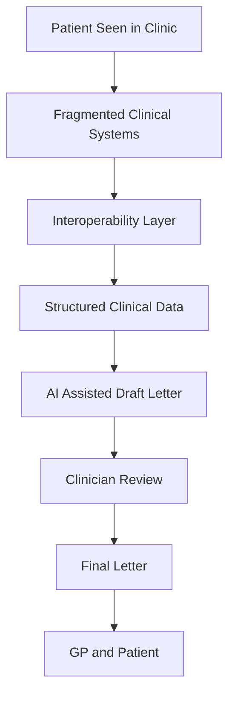

# Designing an Interoperable, AI-Assisted Clinical Documentation Workflow 

A conceptual digital health project that explores how interoperability and AI can improve clinical documentation workflows in NHS outpatient care. 

## Problem 

In current NHS outpatient workflows, clinical data is fragmented across multiple healthcare systems. This leads to clinician manually retrieving, reconciling and synthesising data from various sources to get a full clinical overview and produce clinic letters. This process is time consuming, increases variability in the quality of letters generated by clinicians and often leads to omission of key safety information. This is followed by administrative transcription and formatting which further adds to the delay in communicating information to primary care. 

## Proposed Solution 

This project proposes a redesigned clinical workflow by integrating fragmented data using an interoperability layer followed by AI-assisted generation of clinic letters. Thus, clinical information is consolidated across various systems using interoperability standards (such as FHIR) and data is then structured into predefined clinical fields. This structured input is used for the generation of AI-assisted clinic letters and clinicians then review and finalise the letter before final dispatch. This shifts the focus from a manual writing process to a review-based and standardised workflow. 

## Workflow Diagram

## Key concepts 

- **Interoperability(FHIR):** Data from multiple healthcare system are consolidated into a unified and structured dataset 

- **AI-assisted documentation:** Structured input is used for generation of AI-assisted letters 

- **Clinical workflow redesign:** This leads to reduction in documentation and administrative burden and prevents duplication 

## Expected Impact 

- **Efficiency:** Efficiency is improved by reducing documentation time and faster turnaround time for primary care communication 

- **Safety:** Improved clarity of follow up action plans and reduction in omission errors 

- **Standardisation:** Eduction in variability of structure and function across clinicians 

- **Scalability:** Standardised frameworks are applicable to broader clinical workflows

## Governance & Safety Considerations

- AI-generated documentation must remain clinician-reviewed prior to final use
- Data used for AI input must be derived from structured and validated clinical sources
- Interoperability systems must ensure data accuracy and consistency across sources
- Workflow design should prioritise patient safety, data integrity, and clinician oversight

## Why this matters 

This model supports the shift towards scalable and data-driven healthcare systems and enables AI-assisted clinical decision support. 

## Full Document

[Download the full project document](workflow_design.pdf)

## How to Cite

If you use or adapt this work, please cite:
- Author: Sharadiya Mitra
- Title: Designing an Interoperable, AI-Assisted Clinical Documentation Workflow
- Year: 2026
- Repository: https://github.com/sharadiyamitra/ai-clinical-documentation-workflow

